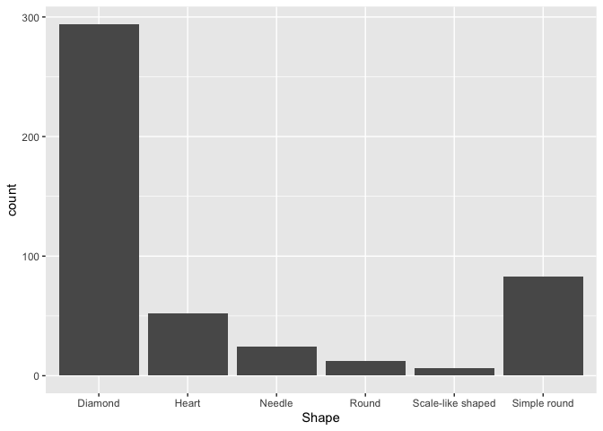

<!-- README.md is generated from README.Rmd. Please edit that file -->

# MedLEA 

<!-- badges: start -->

<!-- badges: end -->

The MedLEA package provides morphological and structural features of 471
medicinal plant leaves.

## Installation

You can install the development version from
[GitHub](https://github.com/) with:

``` r
# install.packages("devtools")
devtools::install_github("SMART-Research/MedLEA")
```

## Example

This is a basic example which shows you how to solve a common problem:

``` r
library(MedLEA)
data("medlea")
head(medlea)
#>   ID                                             Sinhala_Name   Family_Name
#> 1  1                                  Tel kaduru (???? ?????) EUPHORBIACEAE
#> 2  2 Telhiriya (?????????) / Mayura manikkam (???? ?????????)    RHAMNACEAE
#> 3  3                                                 Thakkali    SOLANACEAE
#> 4  4                                                    Thala   PEDALIACEAE
#> 5  5                                                Thana hal       POACEAE
#> 6  6                          Thebu (????) / Koltan (???????) ZINGIBERACEAE
#>                    Scientific_Name   Shape Arrangements Bipinnately_compound
#> 1                   Sapium insigne   Round       Simple                False
#> 2 Colubrina asiatica var. asiatica   Round       Simple                False
#> 3          Lycopersicon esculentum Diamond     Compound                False
#> 4                  Sesamum indicum Diamond       Simple                False
#> 5                  Setaria italica Diamond       Simple                False
#> 6                 Costus speciosus   Round       Simple                False
#>   Pinnately_compound Palmately_compound   Edges Uniform_background Red_Margin
#> 1              False              False  Smooth               True      False
#> 2              False              False Toothed               True      False
#> 3               True              False   Lobed               True      False
#> 4              False              False  Smooth               True      False
#> 5              False              False  Smooth               True      False
#> 6              False              False  Smooth               True      False
#>   Shaded_margin White_Shading Red_Shading White_line Green_leaf Red_leaf
#> 1         False         False       False      False       True    False
#> 2         False         False       False      False       True    False
#> 3         False         False       False      False       True    False
#> 4         False          True       False      False       True    False
#> 5         False         False       False      False       True    False
#> 6         False         False       False      False       True    False
#>      Veins Arrangement_on_the_stem Leaf_Apices          Leaf_Base
#> 1  Pinnate                 Whorled       Acute             Obtuse
#> 2  Pinnate               Alternate       Acute             Acuate
#> 3  Pinnate                Opposite      Obtuse            Cordate
#> 4  Pinnate                 Whorled       Acute            Cuneate
#> 5 Parallel                Opposite       Acute Gradually tapering
#> 6 Parallel               Alternate       Acute             Obtuse
```

## Composition by Shape of Leaves

``` r
library(tidyverse)
#> ── Attaching packages ─────────────────────────────────────── tidyverse 1.3.0 ──
#> ✓ ggplot2 3.3.3     ✓ purrr   0.3.4
#> ✓ tibble  3.1.0     ✓ dplyr   1.0.5
#> ✓ tidyr   1.1.3     ✓ stringr 1.4.0
#> ✓ readr   1.4.0     ✓ forcats 0.5.1
#> ── Conflicts ────────────────────────────────────────── tidyverse_conflicts() ──
#> x dplyr::filter() masks stats::filter()
#> x dplyr::lag()    masks stats::lag()
medlea %>% ggplot(aes(x=Shape)) + geom_bar() 
```


