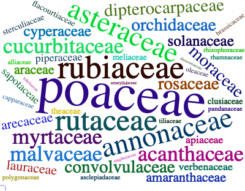
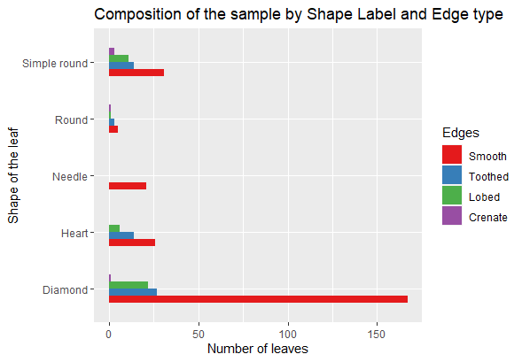

<!-- README.md is generated from README.Rmd. Please edit that file -->

# MedLEA 

<!-- badges: start -->

<!-- badges: end -->

The MedLEA package provides morphological and structural features of 471
medicinal plant leaves and 1099 leaf images of 31 species and 29-45
images per species.

## Installation

You can install the development version from
[GitHub](https://github.com/) with:

``` r
# install.packages("devtools")
devtools::install_github("SMART-Research/MedLEA")
```

## Visual representation of description of variables in the dataset


## Example

``` r
library(MedLEA)
#> Loading required package: patchwork
#> Loading required package: tm
#> Loading required package: NLP
#> Loading required package: wordcloud2
data("medlea")
head(medlea)
#>   ID                                             Sinhala_Name   Family_Name
#> 1  1                                  Tel kaduru (???? ?????) EUPHORBIACEAE
#> 2  2 Telhiriya (?????????) / Mayura manikkam (???? ?????????)    RHAMNACEAE
#> 3  3                                                 Thakkali    SOLANACEAE
#> 4  4                                                    Thala   PEDALIACEAE
#> 5  5                                                Thana hal       POACEAE
#> 6  6                          Thebu (????) / Koltan (???????) ZINGIBERACEAE
#>                    Scientific_Name   Shape Arrangements Bipinnately_compound
#> 1                   Sapium insigne   Round       Simple                False
#> 2 Colubrina asiatica var. asiatica   Round       Simple                False
#> 3          Lycopersicon esculentum Diamond     Compound                False
#> 4                  Sesamum indicum Diamond       Simple                False
#> 5                  Setaria italica Diamond       Simple                False
#> 6                 Costus speciosus   Round       Simple                False
#>   Pinnately_compound Palmately_compound   Edges Uniform_background Red_Margin
#> 1              False              False  Smooth               True      False
#> 2              False              False Toothed               True      False
#> 3               True              False   Lobed               True      False
#> 4              False              False  Smooth               True      False
#> 5              False              False  Smooth               True      False
#> 6              False              False  Smooth               True      False
#>   Shaded_margin White_Shading Red_Shading White_line Green_leaf Red_leaf
#> 1         False         False       False      False       True    False
#> 2         False         False       False      False       True    False
#> 3         False         False       False      False       True    False
#> 4         False          True       False      False       True    False
#> 5         False         False       False      False       True    False
#> 6         False         False       False      False       True    False
#>      Veins Arrangement_on_the_stem Leaf_Apices          Leaf_Base
#> 1  Pinnate                 Whorled       Acute             Obtuse
#> 2  Pinnate               Alternate       Acute             Acuate
#> 3  Pinnate                Opposite      Obtuse            Cordate
#> 4  Pinnate                 Whorled       Acute            Cuneate
#> 5 Parallel                Opposite       Acute Gradually tapering
#> 6 Parallel               Alternate       Acute             Obtuse
```

## Wordcloud of Family of the Medicinal Plants

``` r
library(tidyverse)
library(wordcloud2)
library(patchwork)
library(tm)

#unique(medlea$Family_Name)

text1 <- medlea$Family_Name
docs <- Corpus(VectorSource(text1))
docs <- docs%>% tm_map(stripWhitespace)
dtm <- TermDocumentMatrix(docs)
matrix <- as.matrix(dtm)
words <- sort(rowSums(matrix), decreasing = TRUE)
df <- data.frame(word = names(words), freq = words)
p1 <- wordcloud2(data = df, size = 0.9,color = 'random-dark', shape = 'pentagon')
p1
```



## Composition of the Sample by Shape and Edge Type of Leaves

``` r
medlea <- filter(medlea, Arrangements == "Simple")

d11 <- as.data.frame(table(medlea$Shape))
names(d11) <- c('Shape_of_the_leaf', 'No_of_leaves')

p2 <- ggplot(d11, aes(x= reorder(Shape_of_the_leaf, No_of_leaves), y=No_of_leaves)) + labs(y="Number of leaves", x="Shape of the leaf") + geom_bar(stat = "identity", width = 0.6) + ggtitle("Composition of the Sample by the Shape Label") + coord_flip()
```

``` r
d11 <- as.data.frame(table(medlea$Edges))
names(d11) <- c('Edges', 'No_of_leaves')
#d11 <- d11 %>% mutate(Percentage = round(No_of_leaves*100/sum(No_of_leaves),0))
#ggplot(d11, aes(x= reorder(Shape_of_the_leaf, Percentage), y=Percentage)) + labs(y="Percentage", x="Shape of the leaf") + geom_bar(stat = "identity", width = 0.5) + geom_label(aes(label = paste0(Percentage, "%")), nudge_y = -3, size = 3.25, label.padding = unit(0.175,"lines")) + ggtitle("Composition of the Sample by the Shape Label") + coord_flip()

p3 <- ggplot(d11, aes(x= reorder(Edges, No_of_leaves), y=No_of_leaves)) + labs(y="Number of leaves", x="Edge type of the leaf") + geom_bar(stat = "identity", width = 0.6) + ggtitle("Composition of the Sample by the Edge Type") + coord_flip()

p2 + p3 + plot_layout(ncol = 1)
```


## Composition of the Sample by Shape and Edge type of Leaves in Simple Arrangement

``` r
medlea <- filter(medlea, Shape != "Scale-like shaped")
d29 <- as.data.frame(table(medlea$Shape,medlea$Edges))
names(d29) <- c('Shape','Edges','No_of_leaves')
d29$Edges <- factor(d29$Edges, levels = c("Smooth", "Toothed","Lobed","Crenate"))


ggplot(d29, aes(fill = Edges, x=Shape , y=No_of_leaves)) + labs(y="Number of leaves", x="Shape of the leaf") + geom_bar(stat = "identity", width = 0.5, position = position_dodge()) + coord_flip() + ggtitle("Composition of the sample by Shape Label and Edge type") + scale_fill_brewer(palette = "Set1")  
```



## Load Medicinal Plant Images

``` r
load_images()
[1] "The repository of leaf images of medicinal plants in Sri Lanka is collected by following the image acquisition steps that we identified."
[1] "The repository contains 1099 leaf images of 31 species and 29-45 images per species.These have simple arrangement. The photographs were taken from the device, Huawei nova 3i. The closest photographs were captured on a white background."
[1] "All the leaf images are in a google drive folder that anyone can access. You can download the images directly from the drive."
[1] "The shareable link: https://drive.google.com/drive/folders/1W3ap8UhBCIVN5U_UUVSZeTh7VG4Jqbev?usp=sharing"
```
